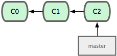
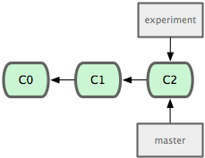
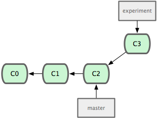
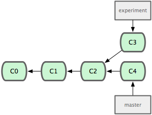
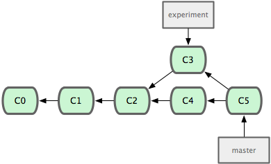
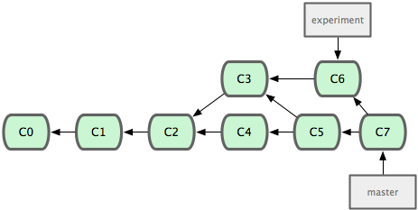

<embed src="http://www.youtube.com/v/tl5IDfwdvxo" type="application/x-shockwave-flash" width="790" height="430" allowscriptaccess="always" allowfullscreen="true"></embed>

As we touched on in the first lesson, the way that Git handles branching and
merging is pretty unique.  First of all, it's incredibly fast, both to create
new branches and to switch between them. Git has a single working directory
that it replaces with the contents of the branch you're working on, so you
don't have to have separate directories for each branch.

In this lesson, we'll create a new branch, do a bit of work, switch back to
our stable branch (generally called 'master' in Git by default), do some work
there, switch back to our temporary branch to complete our work, and then
merge it into our stable branch.

To view our available branches, we run the 'git branch' command with no
arguments.

	$ git branch
	* master

We can see that we only have one branch 'master' and the '\*' indicates that we
are currently on it.  For the purposes of illustrating this, I will show the
commit history model.  Here, the green boxes are each commit and the arrows
are where each commit points to for its parent or parents.  This is basically
how Git actually stores its commit data.

You can see, in Git, branches are simply lightweight pointers to a particular
commit.  The history is simply figured out by traversing the parents, one
commit at a time.

### creating new branches ###

To create a new branch, we can use 'git branch (branchname)' which will create
a branch at the point we're currently at.

	$ git branch experiment

To switch to that branch so that the work we do is saved to it instead of the
'master' branch, we run the 'git checkout' command'

	$ git checkout experiment
	Switched to branch "experiment"
	$ git branch
	* experiment
	  master

Now we can see that we have a new branch and that we're on it. Now we can edit
files and commit without worrying about messing up our pristine 'master' branch
that we know works perfectly.  We don't have to share the changes we make in our
'experiment' branch until we are certain they are ready.

### working in multiple branches ###

So, let's add a TODO file, make a change to the 'simplegit.rb' file, and then
make a commit with both changes in it.

	$ vim lib/simplegit.rb
	$ vim TODO
	$ git add TODO
	$ git commit -am 'added a todo and added simplegit functions'
	[experiment]: created 4682c32: "added a todo and added simplegit functions"
	 2 files changed, 10 insertions(+), 0 deletions(-)
	 create mode 100644 TODO

Now if we take a look, we can see that we have 3 files and one subdirectory.

	$ ls
	README		Rakefile	TODO		lib

So, let's now suppose that we need to go back and make a bugfix on our original
verison of the simplegit.rb file.  We can revert back to where our project
was before we branched with the 'checkout command.

	$ git checkout master
	Switched to branch "master"
	$ ls
	README		Rakefile	lib

Now we can see that our working directory no longer has the TODO file it in -
that's because the master branch didn't have that file.  If we do a commit here
and then switch back, we'll see the TODO file there again, and the simplegit.rb
file reverted back to where we left it in the experiment branch.

	$ vim lib/simplegit.rb
	$ git commit -am 'added a commit function'
	[master]: created 0b7434d: "added a commit function"
	 1 files changed, 4 insertions(+), 0 deletions(-)
	$ git checkout experiment
	Switched to branch "experiment"
	$ ls
	README		Rakefile	TODO		lib

We could even go back to the master branch and create a new branch and start
committing there.  Most Git developers will have several branches running at
the same time, each with a specific theme or focus - a new feature or bug fix
that lasts hours or even minutes, or longer running branches for large scale
refactorings that periodically merge in changes from mainline branches.

This practice of cooking your features and changes in branch silos makes it
easy and cheap to context switch rapidly and without complications.  If you
want to work on a longer running branch with another developer, you can push
branches up to a shared server.  For example, if you wanted to work on the
experiment branch with someone else, you can push it to your server like so:

	$ git push origin experiment

The next pull your collaborator does will pull that work down and let them
work on it with you.  However, Git also importantly lets you keep these branches
private if you want - simply don't push them.

### merging and removing finished branches ###

When you are done with work on a branch, you can either remove it and ignore
the changes made on it if the work is not acceptable, or you can merge it
into one of your long running branches (some developers will have 'master' only
contain stable code, a parallel 'develop' branch that you use to integrate and
test changes, and shorter lived topic branches for day to day work).

To merge a branch in, switch to the branch you want to merge into and run
the 'git merge' command.  If it can merge cleanly, you'll simply see something
like this:

	$ git merge experiment
	Auto-merging lib/simplegit.rb
	Merge made by recursive.
	 lib/simplegit.rb |    1 +
	 1 files changed, 1 insertions(+), 0 deletions(-)

Easy peasy - you're merged.

### merge conflict resolution ###

However, sometimes things don't go so smoothly
If you get a merge conflict, you'll see something like this instead.

	$ git merge experiment
	Auto-merging lib/simplegit.rb
	CONFLICT (content): Merge conflict in lib/simplegit.rb
	Automatic merge failed; fix conflicts and then commit the result.

In this case it will tell you the files that did not merge cleanly, and you
can simply resolve the conflicts manually.  If I open up the file it says
failed, I'll see normal merge conflict markers in it.

	<<<<<<< HEAD:lib/simplegit.rb
	  def commit(message)
	    command("git commit -m '#{message}'")
	=======
	  def add(path)
	    command("git add #{path}")
	>>>>>>> experiment:lib/simplegit.rb
	  end

When you're done fixing it, all you have to do is run 'git add' on the file
to re-stage it, which marks it as resolved.  Then commit the merge.

	$ git add lib/simplegit.rb
	$ git commit
	[master]: created 6d52a27: "Merge branch 'experiment'"

### merging multiple times ###

I point this out because it's something that is generally difficult to do in
some other VCSs, but is very easy in Git.  That is, merging from a branch, then
continuing to do work in it and merging again.  This is often the case if you
have a 'development' branch that you do integration testing and merge experimental
changes into and then periodically merge it into your stable 'master' branch.

For example, let's say we switched back to the 'experiment' branch, made a few
changes, then at some point merged it back into 'master' again, making our
history look something like this.

Since Git does its merges as a simple 3 way merge based on the commit history
snapshots, doing multiple merges is often very easy.  It will only have to
merge in changes introduced on both branches since the last merge - it will not
have to re-merge anything.

When you are done with a branch, say in this case the 'experiment' branch, we
can simply delete it with 'git branch -d'

	$ git branch -d experiment

If the branch has not been merged in at some point, in which case deleting the
branch would lose changes, Git will not allow you to do it.  If you _want_ to
lose the changes, simply use the '-D' flag instead - that will force the
deletion.

So, that is basic branching and merging in Git and should give you a good
baseline for being able to effectively use this powerful and ultimately pretty
simple tool.

For more information on branching and merging in Git, you can read [Chapter 3](http://git-scm.com/book/en/Git-Branching)
of the Pro Git book.

  <a href="normal.html" class="page-prev">&laquo; Normal Workflow</a><a href="remotes.html" class="page-next">Distributed Git &raquo;</a>

