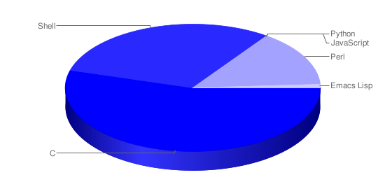
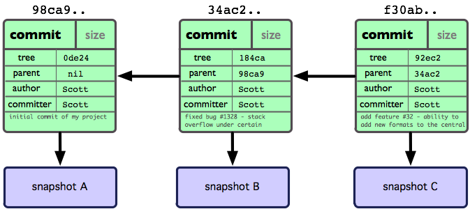

<embed src="http://www.youtube.com/v/hKfo0OXc1BI?hl=en_US&amp;version=3&amp;rel=0" type="application/x-shockwave-flash" width="790" height="430" allowscriptaccess="always" allowfullscreen="true"></embed>

Welcome to the first lesson of the GitHub Learning course.  This course
will lead you through a series of lessons that will demonstrate how to use
Git quickly and easily - many of the lessons will have screencasts that you
can watch as well, if you learn better that way.

This chapter is about what Git is and why you should use it - just a quick
introduction before we start using it.

Git is a **fast, open source, distributed version** control system that is quickly
replacing subversion in open source and corporate programming communities.

### version control system 

First off, Git is a _version control system_, a simple command line
tool for keeping a history on the state of your source code projects. You
use it as you might use something like Subversion, CVS or Perforce.

You tell it to track files in your project and periodically commit the state
of the project when you want a saved point.  Then you can share that history
with other developers for collaboration, merge between their work and yours,
and compare or revert to previous versions of the project or individual files.

As it is primarily a command line tool, most of the examples in this course
will show the command line versions of the functions.  We will be using a
recent version of Git (the 1.7 series) for the examples in this course.  We
recommend upgrading to the 1.7 series if your version of Git is older - there
have been a number of UI improvements that make Git a bit easier to use.

	$ git --version
	git version 1.7.1

If you need help with any of the commands, you can type '--help' and it will
show you the _man_ page. You can also type 'git help _command_' for the same thing.

	$ git log --help
	$ git help log

### open source

Git is an open source project that has been active for several years and is
written mostly in C.

At any time you can get the full source code to analyze or improve upon.
To get a download of the source code, visit
[git-scm.com/download](http://git-scm.com/download).  Git is licensed under
the GNU General Public License.

### offline and fast

Git is fully distributed, which means that it can work almost entirely offline.
In stark contrast to VCS tools like Perforce or Subversion, Git does nearly all
of its operations without needing a network connection, including history
viewing, difference viewing and commiting.

This also means that Git is very fast compared to those systems partially due
to the fact that none of these operations has any dependency on network latency.
For example, take a look at how fast the simple 'log' command takes to run in
Git and in Subversion.

	[master]$ time git log > /dev/null

	real	0m0.352s
	user	0m0.300s
	sys	0m0.034s

	$ time svn log > /dev/null

	real	0m3.709s
	user	0m0.482s
	sys	0m0.168s

Git at 0.3 seconds vs Subversion at 3.7 seconds. That is a difference of a
full order of magnatude.  You'll find similar
differences with nearly any command comparison.  For example, adding the popular
famfamfam icon set and committing them.  Since you can separate the commit from the
network 'push' in Git, this action takes a quarter of a second in Git, but 45 seconds
in Subversion.

	time 'git add icons; git commit -m "added icons"'

	real	0m0.273s
	user	0m0.032s
	sys	0m0.008s

	time 'svn add icons; svn commit -m "added icons"'

	real 	0m45.276s
	user	0m15.997s
	sys	0m5.503s

Even if you needed to push to a shared repository at that time as well, it still
takes far, far less time than Subversion.

	time git push

	real	0m6.219s
	user	0m0.023s
	sys	0m0.011s

If you just want to commit and keep working, you're looking at a huge time
difference - one that severely changes your workflow.
Most commands in Git seem instantaneous - no more typing 'svn commit' and
then going for a cup of coffee.

### small (vs svn) 

Git is also very space efficient.  For example, if you import the Django project
from SVN into Git and compare their checkout/clone sizes, Git comes out very
favorably.

	$ du -d 1 -h
	 44M	./django-git
	 53M	./django-svn

Interestingly, it is even smaller than the Subversion checkout, which is pretty
amazing, considering that the Git clone contains the entire history of the project -
every version of every file back to the first commit, whereas the Subversion
checkout is just the last version of the project.

### snapshots, not changesets

Unlike most other VCSs, Git is snapshot based.  That is, instead of thinking
about and storing commit points as file based patches or changes, it stores it
as a simple snapshot of what your project looked like when you committed.

Commits, then, are simply objects that contain some metadata about the commit
(the message, author, date, etc), a pointer to a single snapshot of the project
and pointers to the commit(s) that came directly before it.  Git's commit history
and data model is really just a directed graph - a simple series of snapshots.

Keeping this in mind is helpful when you're thinking about what Git will do
in a given situation.

For a more in-depth examination of how Git stores data, checkout
[Git for Computer Scientists](http://eagain.net/articles/git-for-computer-scientists/).

### cheap branching and easy merging

Probably the most compelling feature of Git, since it often fundamentally
changes the way that many developers work, is Gits branching model.  Instead
of the popular VCS branching method of simply cloning into a separate directory
for a branch, Git lets you switch between branches in a single working directory.
Add to that the fact that creating and switching between branches is nearly
instant, not all of your branches need to be shared, and it's easy to stash
partially completed work - means that the way you work can be incredibly different.

Instead of only having branches for major development line departures, Git
developers routinely create, merge and destroy multiple branches a week, or even
per day.  Often each feature or bug you are working on can have its own branch,
merged in only when it is complete.  This model allows you to experiment quickly,
easily and safely - without having to go through hoops to get back to where you
where.  It enables and encourages a _non-linear_ development cycle, where you
can work on multiple lines of thought in parallel without them stepping on
each other.

Many developers feel that this is so incredibly helpful and has changed
their workflow and productivity so much that they dub it the
["killer feature"](http://www-cs-students.stanford.edu/~blynn/gitmagic/ch04.html)
of Git.

### installing git

See the [Pro Git book](http://git-scm.com/book/en/Getting-Started-Installing-Git)
for details on how to install Git on your particular operating system.  Or,
simply go to the [download](http://git-scm.com/download) page on git-scm.com to
get the source or an installer for your system.

### resources

For more information on Git, the homepage is at [git-scm.com](http://git-scm.com).
We will also be referring heavily to the Creative Commons licenced 
[Pro Git book](http://git-scm.com/book) for more information on each of these sections.

  <a href="setup.html" class="page-next">Setup and Initialization &raquo;</a>

