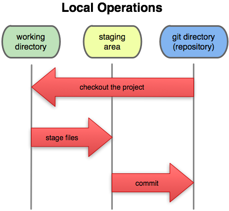

<embed src="http://www.youtube.com/v/U1ayH6KLqxo" type="application/x-shockwave-flash" width="790" height="430" allowscriptaccess="always" allowfullscreen="true"></embed>

So you have a Git repository and everything is all setup.  What now?

Generally, it is not going to be much different than working with any other
source control system. The only real difference should be the staging process.
The workflow will generally go something like this:

* modify files
* see what you've changed
* stage the changes you want to commit
* commit your staged changes
* rinse, repeat

That is the most complex case. If you're not collaborating with anyone and so
have no upstream repository to push to, and you want to ignore the staging area,
it can be as simple as:

* modify files
* commit your changes
* repeat

Easy peasy.  Remember, Git is decentralized, so you don't actually need a public
or shared server to commit to - you can use it like RCS if you want and just
track local changes.

### the simple case ###

The first thing we're going to do is modify some files.  Let's say we're
working on a simple library that wraps the Git command line in a Ruby library.
If you want to follow along, you can clone the project from
[its GitHub page](http://github.com/schacon/simplegit).

	$ git clone git://github.com/schacon/simplegit.git
	$ cd simplegit

For this first example we'll modify the README file to add ourselves as an
author on the project.  

First, we simply edit the file.  Now we want to commit
that change, so we run the 'git commit -a' command.  The '-a' tells Git to
stage all modified files and then commit - we'll cover the 'staging area' next,
but for now just running 'git commit -a' will act something like the 'commit'
command in SVN.

A prompt for a commit message will open in our editor (the $EDITOR environment 
variable or 'core.editor' git config variable - by default it uses 'vim') 
that looks like this:

	_
	# Please enter the commit message for your changes. Lines starting
	# with '#' will be ignored, and an empty message aborts the commit.
	# On branch main
	# Changes to be committed:
	#   (use "git reset HEAD <file>..." to unstage)
	#
	# modified:   README
	#
	~
	~
	".git/COMMIT_EDITMSG" 9L, 253C

We simply type our commit message and exit the editor.

	$ git commit -a
	[master]: created 5896d4d: "added myself to the README as an author"
	 1 files changed, 2 insertions(+), 1 deletions(-)

Git will show us the commit message we typed and some statistics about what
changes were introduced in that commit.  It will also give us a checksum of the
commit, '5896d4d', that we can use to refer to this exact commit later on.

That's it - that's the simple case.  Edit files, 'git commit -a', repeat.

### using the staging area ###

Now we're going to cover how to more carefully craft commits using what Git
calls the 'staging area'.  For this example, let's say that we have updated
your files like we did in the previous section.  However, let's now imagine 
that we wanted to commit the changes we've made as two
separate commits rather than one.  We can see what has been changed in our
working directory by using the 'git status' command.

	$ git status
	# On branch master
	# Changed but not updated:
	#   (use "git add <file>..." to update what will be committed)
	#   (use "git checkout -- <file>..." to discard changes in working directory)
	#
	#	modified:   README
	#	modified:   lib/simplegit.rb
	#
	no changes added to commit (use "git add" and/or "git commit -a")

We can see that we have two files in the 'Changed but not updated' section, which
means that they are **unstaged**.  That is, if we commit right now, nothing
will happen.  You have to **stage** a file before you can commit it.

So, let's stage the files.  Git uses the 'git add' command both to begin tracking
files and also to stage changes to them.  We'll stage the changes in just
the README file, then take a look at our status again.

	$ git add README
	$ git status
	# On branch master
	# Changes to be committed:
	#   (use "git reset HEAD <file>..." to unstage)
	#
	#	modified:   README
	#
	# Changed but not updated:
	#   (use "git add <file>..." to update what will be committed)
	#   (use "git checkout -- <file>..." to discard changes in working directory)
	#
	#	modified:   lib/simplegit.rb

The 'lib/simplegit.rb' file is still unstaged, but the README file is now
under the 'Changes to be committed' section - it is **staged**.  If we run
the commit command (without the -a, which automatically stages everything), only
the changes to that file will go into the commit - the 'simplegit.rb' file will
remain unstaged.  In this instance, we'll use the '-m' option with 'git commit'
to specify the commit message on the command line.

	$ git commit -m 'updated the README'
	[master]: created 14bb3c6: "updated the README"
	 1 files changed, 1 insertions(+), 2 deletions(-)

If we run 'git status' again, we can see that the staged file is now
committed and all we have left is the unstaged 'simplegit.rb' file.

	$ git status
	# On branch master
	# Your branch is ahead of 'origin/master' by 1 commit.
	#
	# Changed but not updated:
	#   (use "git add <file>..." to update what will be committed)
	#   (use "git checkout -- <file>..." to discard changes in working directory)
	#
	#	modified:   lib/simplegit.rb
	#

We can stage and commit that file into a second commit:

	$ git commit -a -m 'added a staging command to the library'
	[master]: created bbaee85: "added a staging command to the library"
	 1 files changed, 4 insertions(+), 0 deletions(-)
	$ git status
	# On branch master
	# Your branch is ahead of 'origin/master' by 2 commits.
	#
	nothing to commit (working directory clean)

Now we have all our changes stored in two commits thematically, so that it can
be easier for our collaborators to understand what we've been working on.  After
the last file is committed we can see that the 'git status' command tells us
that our working directory is clean (and also that our current branch has two
commits that we haven't pushed yet).

If during the 'staging' part of this workflow you want to see not just what files
have changed or are staged, but what the differences are, you can use the `git diff`
command to find that out.

### changes that have not been staged ###

One of the most common things you'll do with 'git diff' is to see what changes
you've made in your working directory that have not been _staged_ yet.

Let's say that we edit the simplegit.rb file to add a function, and we edit
the README file to add a new author to the list.  Then we stage the README
file with 'git add'.  Running 'git status' will show us that README is staged
and simplegit.rb is modified but not yet staged.

	$ vim lib/simplegit.rb
	$ vim README
	$ git add README
	$ git status
	# On branch master
	# Changes to be committed:
	#   (use "git reset HEAD <file>..." to unstage)
	#
	#	modified:   README
	#
	# Changed but not updated:
	#   (use "git add <file>..." to update what will be committed)
	#   (use "git checkout -- <file>..." to discard changes in working directory)
	#
	#	modified:   lib/simplegit.rb
	#

However, what was actually changed in 'simplegit.rb'?  How can I see what
changes I've made that I'm going to stage?  The answer is to run 'git diff'
with no arguments.

	$ git diff
	diff --git a/lib/simplegit.rb b/lib/simplegit.rb
	index dd5ecc4..8ac6604 100644
	--- a/lib/simplegit.rb
	+++ b/lib/simplegit.rb
	@@ -25,6 +25,10 @@ class SimpleGit
	     command("git log -n 25 #{treeish}")
	   end

	+  def log_single(branch = 'master')
	+    command("git log --pretty=oneline #{branch}")
	+  end
	+
	   def blame(path)
	     command("git blame #{path}")
	   end

I can easily see the function that I added and now I can decide if I want to
stage the file like this.  Notice that it does *not* show the change to the
README file.

### changes that are staged but not committed ###

In order to see the changes that have been staged already, you can pass the
'--staged' option to 'git diff' (in pre-1.6 versions of Git, use '--cached').

	$ git diff --staged
	diff --git a/README b/README
	index c526f88..879f0d4 100644
	--- a/README
	+++ b/README
	@@ -8,3 +8,4 @@ It is an example for the Git Peepcode book that I'm currently writin
	 Author : Scott Chacon (schacon@gmail.com)
	          Orange Peel Chacon (opchacon@gmail.com)
	          Magnus O. Chacon (mchacon@gmail.com)
	+         Josephine Chacon (jo.chacon@gmail.com)

This is a very useful command because it tells you what changes you're introducing
were you to run 'git commit' (without the '-a') at that point.

OK, now we've seen how to modify, stage and commit changes to files.  Next we'll
look at one of the killer features of Git, its branching model.

For more information on basic Git usage, you can read [Chapter 2](http://git-scm.com/book/en/Git-Basics)
of the Pro Git book.

  <a href="setup.html" class="page-prev">&laquo; Setup and Initialization</a><a href="branching.html" class="page-next">Branching and Merging &raquo;</a>

