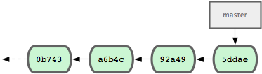
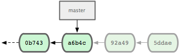
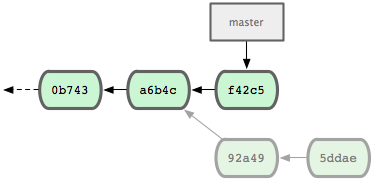
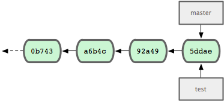
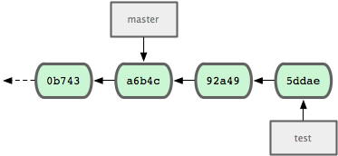
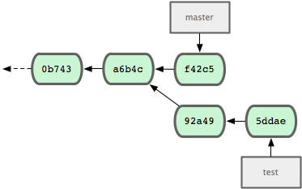

There are a number of situations in Git where you may want to undo or revert
a change that you made.  Perhaps you staged a file and then decided that you
didn't want it staged. Or you edited a file and then wanted to 'un-edit' it.
This section will explore a couple of ways you can undo or revert actions in 
Git.
 
### unstaging files ###

Here we've staged changes to both our README and simplegit.rb files, but then
we decide that we want the changes to be in two separate commits.  So, we need to
unstage one, do a commit, then stage it again and do our second commit.  Luckily,
Git reminds you how to do this right in the 'git status' command output.

	$ git status
	# On branch nolimit
	# Changes to be committed:
	#   (use "git reset HEAD <file>..." to unstage)
	#
	#	modified:   README
	#	modified:   lib/simplegit.rb
	#

If you ever forget how to unstage a file, just run the 'git status' command
to remind yourself with the _(use "git reset HEAD (file)..." to unstage)_
text.  So let's use that to unstage the README file.

	$ git reset HEAD README 
	README: locally modified
	
Now if we run the 'status' command again, we can see that the README file is 
no longer staged.

	$ git status
	# On branch nolimit
	# Changes to be committed:
	#   (use "git reset HEAD <file>..." to unstage)
	#
	#	modified:   lib/simplegit.rb
	#
	# Changed but not updated:
	#   (use "git add <file>..." to update what will be committed)
	#   (use "git checkout -- <file>..." to discard changes in working directory)
	#
	#	modified:   README
	#
	
If you want an easier way of remembering this, you can add an 'unstage' alias
in your Git config file.

	$ git config --global alias.unstage 'reset HEAD'

Then you can just run:
	
	$ git unstage README

A bit nicer, yes?
	
### unmodifying files ###

Now, let's say that we want to completely throw away the changes we made to 
the README file altogether.  **Be careful - this is almost never a great idea
and there is no way to get changes back if you do this!**  Things you commit
are almost always recoverable, but if you throw them away before you commit,
you're out of luck if you ever want them back.  However, if you _did_ want to
do this, 'git status' again gives you a nice tip.

	$ git status
	# On branch nolimit
	# Changed but not updated:
	#   (use "git add <file>..." to update what will be committed)
	#   (use "git checkout -- <file>..." to discard changes in working directory)
	#
	#	modified:   README
	#	modified:   lib/simplegit.rb
	#

So, to 'discard changes in working directory', you simply run 

	$ git checkout -- README
	$ git status
	# On branch nolimit
	# Changed but not updated:
	#   (use "git add <file>..." to update what will be committed)
	#   (use "git checkout -- <file>..." to discard changes in working directory)
	#
	#	modified:   lib/simplegit.rb
	#

And the README changes are gone.  If you instantly regret that choice, your
only recourse is weeping upon your pillow.

### resetting a project ###

Another powerful and easily destructive tool is the 'reset --hard' command.
This will forcefully replace your staging area and working directory with
an older version and move your current branch there.  So, let's say you did
a couple of commits and then completely change your mind and want to just
wipe them away.

Let's say your history log looked like this:

	$ git log --pretty=oneline
	5ddae49fa3f36d892851cbb28549af98d36338fc added staged command
	92a4920c418f7545f995d0c9562f63d1b0f0b48f introduced shortlog and a new author
	a6b4c97498bd301d84096da251c98a07c7723e65 beginning write support
	0b7434d86859cc7b8c3d5e1dddfed66ff742fcbc added a commit function
	9fceb02d0ae598e95dc970b74767f19372d61af8 updated rakefile
	964f16d36dfccde844893cac5b347e7b3d44abbc commit the todo

and you want to completely throw away the top two commits.  All you have to 
do is reset your current branch to the SHA of the commit you want to rewind to.
In this case, the 'beginning write support' or 'a6b4c974'.

	$ git reset --hard a6b4c974
	HEAD is now at a6b4c97 beginning write support

So, whatever branch we were on (in this case, 'master'), is now pointing at 
our older commit, and commits we do from that point forward will move forward 
from there, leaving the ones we rewound past behind.

### breaking work into a topic branch ###

You can also use the '--hard' option for good.  Let's say you did a couple 
of commits on your 'master' branch that after you've committed them you decide
should really have been on a topic branch.  How do we move those commits to
a topic branch?  Turns out it's pretty easy, actually - you just create the
branch where you are, then move the 'master' pointer back to where you should
have left it.  Let's do the same example, but this time leave our commits in
a topic branch for later.

First, we drop a 'bookmark' where we are.  This is generally a useful idea - 
if you're going to try something you are not sure is going to work, just 
create a branch where you are, so you can always get back to there.

	$ git branch test

Now we have a branch at the point we were and can move around the 'master' 
branch with the 'reset' command.  Let's do our reset to the older commit.

	$ git reset --hard a6b4c974
	HEAD is now at a6b4c97 beginning write support

Now we can start working again and our master branch will move forward as
if we had branched separately from our 'test' branch originally.

	$ git commit

And now our commits are tucked away in a branch that we can come back to later
if we want to.

  <a href="log.html" class="page-prev">&laquo; Git History</a><a href="rebasing.html" class="page-next">Git Rebase &raquo;</a>

